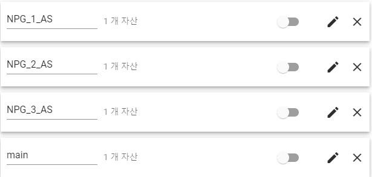
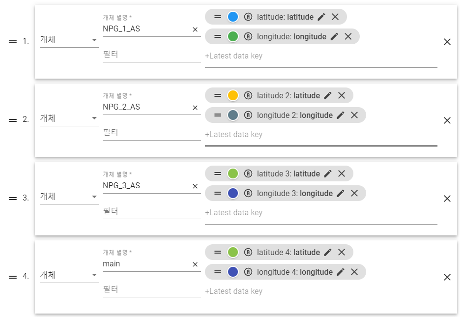
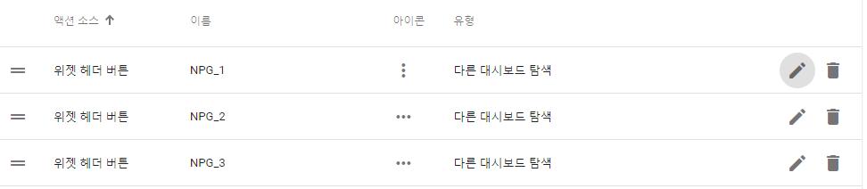

# Thingsboard Kakao Map Widget

## Version
- thingsboard 3.4.4

## Function
> - Device | Asset 표시 (Marker + CustomOverlay) 
> - Device | Asset 추가 시 Marker 추가 (Marker) 
> - 관련된 대시보드로 이동 (Marker Click Event) 
> - 크기에 따른 출력 맵 조절 (Relayout) 

## How to use
### Preparation
- Server Attribute - 위도, 경도 정보가 저장되어 있는 Device or Asset
- Marker Click Event 사용시 메인 대시보드 이외의 추가 대시보드 구성
- 카카오맵 api key => json 파일 {apikey} 부분 변경

### Installation
1. Widget Library - Widget Bundle - 새로운 폴더 생성
2. 생성된 폴더 안에서 kakao_map.json Import

## Procedure
1. 메인 대시보드에서 Device or Asset alias 등록

 

> - 초기 지도 중심 위치를 설정할 Device or Asset의 alis는 'main'으로 설정 

2. kakao map 위젯 데이터 소스 추가

 

> - Device or Asset 서버 속성에 설정한 위도, 경도 데이터만 추가 

3. kakao map 위젯 액션 추가

 

> - action name은 링크 걸어줄 대시보드의 이름과 동일하게 설정 
> - 'Show/hide action using function' 활성화 - return false; 
> - 유형 - '다른 대시보드 탐색' 
> - 대상 대시보드 - 링크 걸어줄 대시보드 

